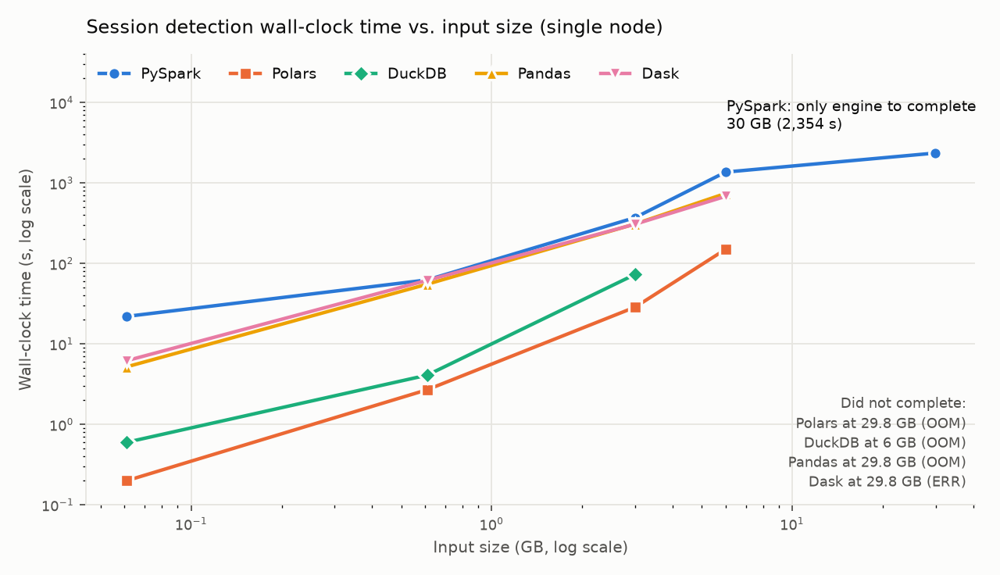

# Stride

**Hierarchical session detection for sensor time series on PySpark, with a five-engine scaling benchmark.**

Stride converts raw, high-frequency sensor readings (for example, robot telemetry) into labelled sessions: periods of activity, sustained movement, and finer-grained sub-phases. Detection is expressed entirely in native PySpark window functions, without Python UDFs, so Spark's Catalyst optimizer can plan the full workload.

The project had two objectives:

1. Build a working session-detection library on Spark.
2. Measure objectively when a distributed engine is justified compared with single-node alternatives (pandas, Polars, DuckDB, Dask).

---

## Key findings



| Input size | PySpark | Polars | DuckDB | pandas | Dask |
|---:|---:|---:|---:|---:|---:|
| 0.06 GB | 22 s | **0.2 s** | 0.6 s | 5 s | 6 s |
| 0.6 GB | 63 s | **2.7 s** | 4.1 s | 55 s | 62 s |
| 3 GB | 372 s | **29 s** | 73 s | 310 s | 308 s |
| 6 GB | 1,367 s | **150 s** | out of memory | 742 s | 683 s |
| 30 GB | **2,354 s** | out of memory | out of memory | out of memory | error |

*Same workload on every engine (gap-based activity sessions plus threshold-based movement sessions over 1.56M base records), run on a single node. Raw results: [`benchmarks/results/scale_sweep_canonical_20260220.json`](benchmarks/results/scale_sweep_canonical_20260220.json).*

1. **Up to 6 GB, Spark was the slowest option.** Polars was 9–110× faster. For most single-team workloads, a single-node columnar engine is the cost-effective choice.
2. **Spark was the only engine to complete at 30 GB.** Its advantage is memory behaviour at scale, not per-record speed.
3. **The crossover depends on available memory, not on row count alone.** The practical decision rule is "does the working set fit in RAM with headroom?", not "is the data big?".

A separate 120-run matrix on a k3s cluster (5 engines × 4 operations × 3 public robotics datasets × 2 file sizes) showed the same pattern at small file sizes: Polars completed windowed session detection in about 1 s, compared with about 12 s for PySpark, where fixed JVM and scheduling overhead dominates. Raw results: [`benchmarks/results/k8s_matrix_results_20260222.json`](benchmarks/results/k8s_matrix_results_20260222.json).

---

## Scope of work

| Area | Delivered |
|---|---|
| Library | `SessionDetector`: gap-based, threshold-based (sustained duration), and entry/exit-signal sessions; session summaries; condition parsing. Pure DataFrame API. |
| Testing | Unit tests on a local Spark session, including a regression test for a window-unit defect found during review (see below). |
| Benchmark harness | Runners for pandas, Polars, DuckDB, Dask, PySpark, and GPU variants (cuDF, RAPIDS Accelerator for Spark); four operations (I/O scan, filter + aggregate, join, windowed session detection); scale-factor sweep. |
| Data | Synthetic robotics telemetry generator, plus loaders for public robot-learning datasets on Hugging Face (DROID, Open X-Embodiment, BEHAVIOR-1K) normalised to a common schema. |
| Infrastructure | Single-node k3s cluster with Airflow 3 (KubernetesPodOperator), MinIO (S3-compatible storage), and NVIDIA RuntimeClass for GPU pods. Helm values and Dockerfiles included. |

## How it works

Session detection is inherently sequential (each row depends on the previous one), while Spark is designed for declarative, partitioned work. Stride maps each session type onto window operations partitioned by entity:

```python
window = Window.partitionBy("robot_id").orderBy("timestamp")

df = (
    df.withColumn("gap_s", F.col("timestamp").cast("double") - F.lag("timestamp").over(window).cast("double"))
      .withColumn("is_new", (F.col("gap_s") > 300) | F.col("gap_s").isNull())
      .withColumn("session_id", F.sum(F.col("is_new").cast("int")).over(window))
)
```

- **Gap sessions:** a new session starts after a period of inactivity (`lag` plus a cumulative sum).
- **Threshold sessions:** a signal must satisfy a condition for a sustained duration (a time-bounded `rangeBetween` window).
- **Hierarchy:** detectors are applied in sequence on the same DataFrame, so every row carries both its parent session ID (for example, activity) and its child session ID (for example, movement).

## Getting started

Requirements: Python 3.10+, Java 11 or 17.

```bash
git clone https://github.com/shubhstiws-new/stride.git
cd stride
pip install -e ".[dev]"

pytest                                            # unit tests (local Spark)
python scripts/run_demo.py --local --robots 5 --hours 1
```

Benchmarks:

```bash
pip install -e ".[benchmark]"
python benchmarks/simulate_scale.py --data-path ./data/robotics_demo --scales 1,10,50
python benchmarks/plot_scale_sweep.py --results <results.json> --out docs/scale_sweep.png
```

## Repository layout

```
hsm_pyspark/spark/session_detector.py   Session detection library
tests/                                  Unit tests (pytest, local Spark)
scripts/run_demo.py                     End-to-end demo on synthetic data
benchmarks/                             Engine runners, operations, datasets, scale sweep, results
airflow/dags/                           Benchmark orchestration on Kubernetes
docker/, setup/                         Container images, k3s / Helm setup, GPU setup
configs/demo.yaml                       Example hierarchical session definition
```

## Methodology notes and limitations

These points are stated so the results can be read accurately:

- **Scaling method differs by engine.** In the scale sweep, Spark generates the N× data lazily with a broadcast cross-join, while the single-node engines hold the replicated data in memory. The out-of-memory results partly reflect this setup, not engine limits alone. A like-for-like comparison would read N× materialised files from disk on every engine, including Polars' streaming mode.
- **Single-node only.** All runs used one machine (Spark in `local[*]` mode with an 8 GB driver). Multi-node Spark behaviour was not measured.
- **Window-unit defect (fixed).** Threshold sessions originally ordered the time window by epoch seconds but bounded it in milliseconds, so a "2 s" window spanned 2,000 s. This inflated movement-session counts in the recorded benchmark runs. It is now fixed and covered by `test_threshold_window_is_measured_in_seconds_not_milliseconds`. Recorded timings predate the fix.
- **YAML configuration is descriptive only.** `configs/demo.yaml` documents the intended hierarchical definition, but the loader that compiles it into detector calls (`hsm_pyspark/config`) is not yet implemented. Sessions are currently configured in Python.
- **Sampling rate is assumed constant** for threshold sessions (`sample_rate_hz`, default 10 Hz).

## Capabilities developed

The project was built in a concentrated sprint (February 20–22, 2026, 29 commits), starting without prior hands-on experience of Spark window semantics, Kubernetes-based orchestration, or GPU dataframe libraries.

- Expressing stateful, sequential logic as declarative window operations
- Designing a fair multi-engine benchmark and documenting where it is not fair
- Operating Airflow 3, MinIO, and GPU workloads on k3s
- Normalising heterogeneous public robotics datasets to a single schema

## License

MIT
